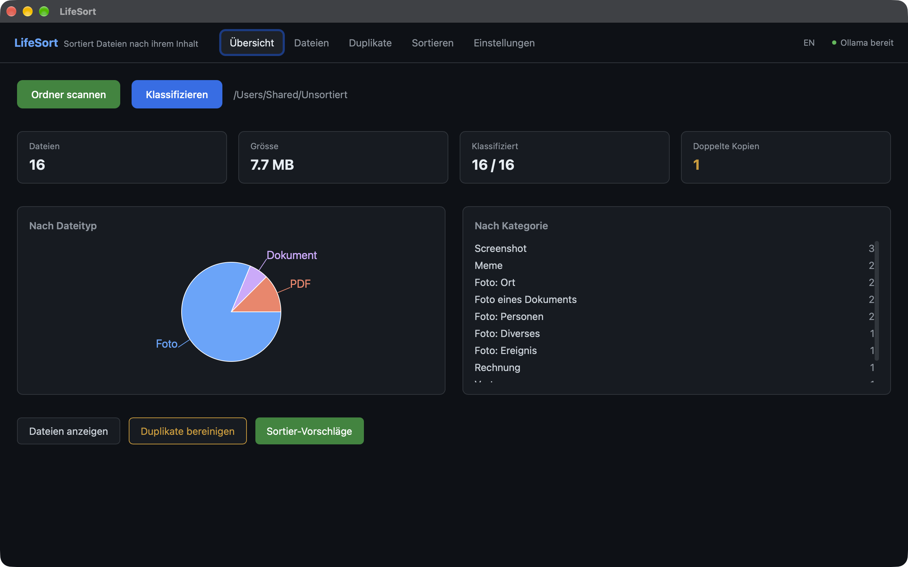
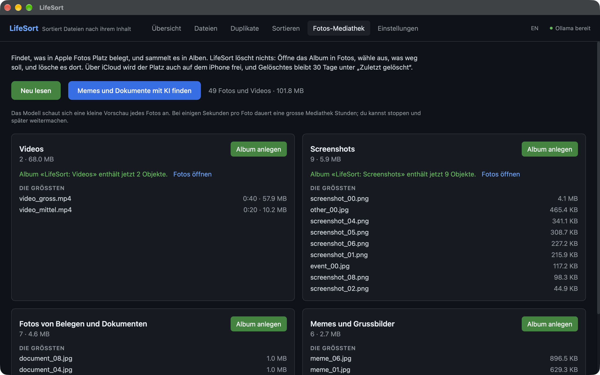
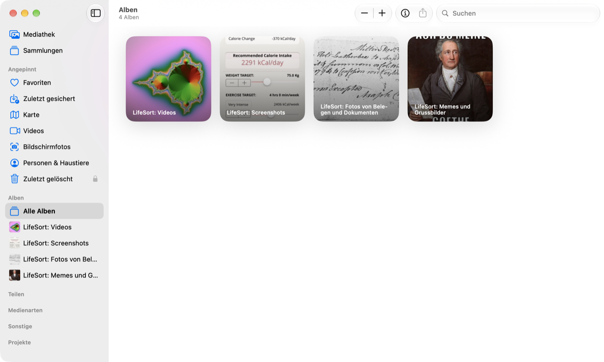

<div align="center">
  

  <h1>LifeSort</h1>
</div>

[🇬🇧 English Version](README.md)

**Sortiert den Haufen, bei dem die Dateinamen nichts verraten.**

`IMG_4471.jpg`, `Scan_002.pdf`, `Download (3).pdf`. LifeSort öffnet sie und
sortiert nach dem, was tatsächlich drin ist: ein lokales Modell schaut sich die
Fotos an und liest die Dokumente. Es läuft über [Ollama](https://ollama.com) auf deinem Gerät.

**Nichts für dich, wenn** deine Dateien schon vernünftig heissen und eine Regel
wie "PDFs nach Dokumente" reichen würde. Das ist Aufgabe einer Regel-Engine, und
[CleanFlow](https://github.com/9t29zhmwdh-coder/CleanFlow) ist die in diesem
Portfolio: es plant nach Regeln, zeigt dir den Plan vorher und führt über jede
Aktion Buch, damit du sie zurückdrehen kannst. LifeSort ist für den Fall, wo
keine Regel hilft, weil der Dateiname nichts sagt.

**Ordner und die Apple-Fotos-Mediathek.** In Ordnern verschiebt LifeSort
Dateien an ihren Platz. Die Fotos-Mediathek verändert es nie: Auf dem Mac
findet es dort, was Platz belegt, und sammelt es in Alben; gelöscht wird in
der Fotos-App, und über iCloud wird der Platz auch auf dem iPhone frei. Siehe
[Apple-Fotos-Modus](#apple-fotos-modus-macos).

Nichts wird ohne deine Bestätigung verschoben, und nichts verlässt das Gerät.

[](https://github.com/9t29zhmwdh-coder/LifeSort/actions) [](https://github.com/9t29zhmwdh-coder/LifeSort/security/code-scanning) [](https://securityscorecards.dev/viewer/?uri=github.com/9t29zhmwdh-coder/LifeSort) [](https://www.bestpractices.dev/projects/13699)

     

> **So läuft es:** LifeSort ist eine native Desktop-App, kein Server und kein Browser-Tool. Sie öffnet sich als eigenes Fenster, funktioniert vollständig offline und hat kein Tray-Icon und keinen Hintergrunddienst; sie läuft nur, solange das Fenster offen ist.



---

> 💾 **Download:** [macOS (DMG)](https://github.com/9t29zhmwdh-coder/LifeSort/releases/latest/download/LifeSort.dmg) · [Windows (Installer)](https://github.com/9t29zhmwdh-coder/LifeSort/releases/latest/download/LifeSort-Setup.exe) · [Linux (AppImage)](https://github.com/9t29zhmwdh-coder/LifeSort/releases/latest/download/LifeSort.AppImage): immer das neueste Release, nicht code-signiert/notarisiert (Gatekeeper/SmartScreen warnen beim ersten Start). Oder aus dem Quellcode bauen, siehe Erste Schritte unten.

---

Die Oberfläche von LifeSort gibt es auf Englisch und Deutsch, beim ersten Start in der Systemsprache; umschaltbar über den Sprachtoggle.

**In der Praxis:** du scannst einen Ordner, LifeSort ordnet jede Datei lokal ein, und du erhältst eine Übersicht mit Sortier-Vorschlägen, die du bestätigst, bevor etwas verschoben wird. Ohne Ollama arbeitet es mit Regeln (Screenshots, Dokumente nach Stichworten, Downloads nach Typ) und zeigt das auch an; das Modell ergänzt die Erkennung von Personen, Orten, Anlässen, Memes und fotografierten Dokumenten.

---

> 🌱 Neu hier? → [Schritt-für-Schritt-Anleitung für Einsteiger](GETTING_STARTED.md)

---

## Funktionen

| Funktion | Was sie tut |
|---|---|
| **Foto-Erkennung** | Personen, Orte, Anlässe, Screenshots, Memes, fotografierte Dokumente, über ein lokales Vision-Modell. HEIC vom iPhone wird auf macOS gelesen |
| **Screenshots ohne KI** | Erkannt an der iOS-EXIF-Markierung, am Dateinamen oder an der exakten Bildschirmgrösse von iPhone, iPad, Android und Mac |
| **Dokument-Einordnung** | Rechnungen, Verträge, Garantien, Steuerunterlagen, Briefe, Zeugnisse, Berichte, mit Datum und Betrag. Liest PDFs mit Textebene und reine Textdateien |
| **Download-Sortierung** | Installer, Archive, Assets und Müll nach Typ und Name |
| **Duplikaterkennung** | Gleicher Inhalt über Grösse und BLAKE3-Hash; Kopien kommen erst nach deiner Bestätigung in den Papierkorb |
| **Sortier-Vorschläge** | Ein Zielordner pro Datei, in der Sprache der Oberfläche, sichtbar bevor etwas verschoben wird. Gleiche Namen bekommen `(2)`, überschrieben wird nie |
| **Rückgängig** | Jede Verschiebung wird protokolliert; Rückgängig klappt auch nach einem Neustart und verweigert, wenn am alten Ort inzwischen etwas liegt |
| **Apple-Fotos-Modus** (macOS) | Findet grosse Videos, Screenshots, nicht ausgewählte Serienbilder, Memes und Fotos von Belegen in der Fotos-Mediathek und sammelt sie in Alben. Löscht nichts |

**Grenzen, offen gesagt:** Gescannte PDFs haben keine Textebene, und LifeSort hat kein OCR, sie bleiben „unbekannt“. Word- und Excel-Dateien werden nicht gelesen. HEIC braucht macOS; unter Windows und Linux werden HEIC-Fotos nur nach Regeln eingeordnet.

---

## Apple-Fotos-Modus (macOS)

Der Reiter „Fotos-Mediathek“ liest die Fotos-Mediathek über Apples PhotoKit und gruppiert, was Platz belegt:

- **Videos**, die grössten zuerst, meist der grösste Brocken
- **Screenshots**, die Fotos selbst als solche markiert
- **Serienbilder**, die nie ausgewählt wurden, aus den Seriendaten von PhotoKit (die Test-Mediathek enthielt keine, diese Gruppe ist also ungetestet)
- Mit dem Modell: **Memes und Grussbilder**, **Fotos von Belegen und Dokumenten** und Screenshots, die Fotos nicht markiert hat

Jede Gruppe wird zu einem Album „LifeSort: …“ in Fotos. **LifeSort löscht und verschiebt nie ein Foto.** Öffne das Album in Fotos, wähle aus, was weg soll, und lösche es dort; mit iCloud-Fotos wird der Platz auch auf dem iPhone frei, und Gelöschtes bleibt 30 Tage unter „Zuletzt gelöscht“. Favoriten werden nie vorgeschlagen. macOS fragt einmal nach dem Zugriff. Das Modell sieht kleine Vorschaubilder; Originale, die nur in iCloud liegen, werden nicht heruntergeladen.



Getestet an einer Mediathek mit 46 Fotos und 3 Videos mit `qwen3.5:4b-mlx`: alle 6 Memes, alle 7 Fotos von Dokumenten und alle 7 Screenshots wurden gefunden, das Favoriten-Video blieb aussen vor, und ein zweites Anlegen ergänzte das Album, statt ein zweites zu erstellen. Zwei normale Fotos, ein dunkles Essensbild und ein Partyfoto, landeten ebenfalls bei den Screenshots; deshalb ein Album vor dem Löschen durchsehen. Bei rund 3 Sekunden pro Foto auf einem M4 Pro dauert eine Mediathek mit 10'000 Fotos den grössten Teil einer Nacht; der Lauf lässt sich stoppen und fortsetzen.



---

## Welches Modell für welchen Mac

Ein Modell erledigt Fotos und Dokumente, also muss nur eines in den Speicher passen. Gemessen mit dem Code der App an 48 Fotos in 7 Kategorien und 14 Dokumenten auf Deutsch, Englisch und Französisch (`cargo run --release --example bench_vision` und `bench_text`, Quellen und Lizenzen in [docs/benchmark](docs/benchmark)).

| Modell | Speicher im Betrieb | Fotos richtig | Dokumente richtig | Sekunden pro Foto* |
|---|---|---|---|---|
| **`qwen3.5:9b-mlx`** | 9,0 GB | **98 %** | 93 % | 5,6 |
| **`qwen3.5:4b-mlx`** (Standard auf macOS) | 4,1 GB | **92 %** | 93 % | 3,1 |
| `qwen3.5:4b` (Standard auf Windows, Linux) | 3,4 GB | 92 % | 93 % | 3,6 |
| `gemma4:12b-mlx` | 7,7 GB | 92 % | 93 % | 4,0 |
| `qwen2.5vl:7b` | 7,3 GB | 88 % | | 7,1 |
| `minicpm-v4.6` | 0,8 GB | 75 % | 86 % | 1,2 |
| `llava:7b` (bisherige Vorgabe) | 5,4 GB | 75 % | | 3,7 |
| `qwen3.5:2b-mlx` | 3,1 GB | 46 % | 71 % | 2,0 |
| nur Regeln, ohne Modell | 0 | nur Screenshots | 86 % | |

\* Auf einem M4 Pro. Auf M1 und M2 nicht gemessen; rechne mit einem Mehrfachen der Zeit. Bei 3 Sekunden pro Foto dauern 1'000 Fotos rund 50 Minuten, ein grosser Ordner ist also eine Aufgabe für die Nacht.

| Dein Mac | Nimm | Warum |
|---|---|---|
| 8 GB | `qwen3.5:4b-mlx` | macOS gibt der GPU etwa zwei Drittel des Speichers, rund 5 GB. Andere Apps schliessen; reicht es trotzdem nicht, `minicpm-v4.6` |
| 16 GB | `qwen3.5:9b-mlx` | Passt in die rund 10,7 GB, die die GPU bekommt. Mit vielen offenen Apps `qwen3.5:4b-mlx` |
| 24 GB oder mehr | `qwen3.5:9b-mlx` | Die 27B-Modelle brauchen 18 GB und mehr; auf einem MacBook Air mit 24 GB passen sie nicht |
| Windows, Linux | `qwen3.5:4b` | MLX-Fassungen laufen nur auf Apple Silicon |

Die `-mlx`-Fassungen laufen in Ollama auf Apples MLX-Engine und brauchen Apple Silicon. Die verbleibenden Fehler der empfohlenen Modelle liegen fast alle an einer Stelle: Essen am Restauranttisch hält das Modell für einen Anlass. Screenshots, Memes, Dokumente und Personen wurden jedes Mal richtig erkannt.

---

## Voraussetzungen

- [Ollama](https://ollama.com) mit einem Modell aus der Tabelle oben, zum Beispiel `ollama pull qwen3.5:4b-mlx`. Optional: ohne Modell sortiert LifeSort nach Regeln
- Zum Bauen aus dem Quellcode: [Rust](https://rustup.rs/) 1.87 oder neuer, [Node.js](https://nodejs.org/) 20+, [Tauri CLI v2](https://tauri.app/) (`cargo install tauri-cli`)
- macOS, Windows oder Linux

---

## Schnellstart

```bash
git clone https://github.com/9t29zhmwdh-coder/LifeSort
cd LifeSort

ollama pull qwen3.5:4b-mlx      # unter Windows oder Linux: qwen3.5:4b

cd frontend && npm install && cd ..
cargo tauri dev
```

Die Kommandozeile macht dasselbe ohne Fenster:

```bash
cargo run -p ls-cli -- organize ~/Downloads --target ~/Sortiert --german            # Probelauf, nur Regeln
cargo run -p ls-cli -- organize ~/Downloads --target ~/Sortiert --german --ai       # mit dem Standardmodell
cargo run -p ls-cli -- organize ~/Downloads --target ~/Sortiert --german --ai --execute
```

---

## Deinstallation / Aufräumen

LifeSort hat keinen Hintergrunddienst.

- **macOS:** App löschen, dann `~/Library/Application Support/ch.raystudio.lifesort/` (Verschiebe-Journal und Einstellungen).
- **Windows:** App deinstallieren, dann `%APPDATA%\ch.raystudio.lifesort\` löschen.
- **Linux:** AppImage löschen, dann `~/.local/share/ch.raystudio.lifesort/`.
- Modelle bleiben in Ollama, bis du sie entfernst: `ollama rm qwen3.5:4b-mlx`.
- Den Zugriff auf Fotos entziehst du unter Systemeinstellungen > Datenschutz & Sicherheit > Fotos oder mit `tccutil reset Photos ch.raystudio.lifesort`. Die von LifeSort angelegten Alben bleiben in Fotos, bis du sie löschst; ein Album zu löschen behält seine Fotos.
- LifeSort fasst nichts ausserhalb der gescannten Ordner und des gewählten Zielordners an.

---

## Datenschutz

Alles bleibt auf deinem Gerät. Fotos und Dokumente gehen nur an die Ollama-Adresse aus den Einstellungen, standardmässig `localhost`. Keine Telemetrie, keine Schriften oder Skripte aus dem Internet. Details in [PRIVACY.md](PRIVACY.md).

---

## Architektur

```
LifeSort/
├── crates/ls-core/      # Rust: Scanner, Einordnung, Sortierung, Journal
├── crates/ls-cli/       # CLI
├── crates/ls-photos/    # Apple-Fotos-Mediathek über PhotoKit (macOS)
├── src-tauri/           # Tauri-v2-Backend + IPC-Befehle
└── frontend/            # React + TypeScript + Tailwind + Recharts
```

Mehr in [ARCHITECTURE.md](ARCHITECTURE.md).

### Ordner, die LifeSort anlegt

Die Namen folgen der Sprache der Oberfläche (Englisch: `Photos/People`, `Documents/Invoices/2024`, …).

```
Fotos/       Personen/  Orte/  Ereignisse/{Jahr}/  Screenshots/  Memes/  Dokumente/  Diverses/
Dokumente/   Rechnungen/{Jahr}/  Vertraege/  Garantien/  Steuern/{Jahr}/  Briefe/  Zertifikate/  Berichte/
Downloads/   Installer/  Archive/  Assets/  Muell/
Medien/      Videos/  Audio/
Code/  Sonstiges/
```

---

**Autor:** [Rafael Yilmaz](https://github.com/9t29zhmwdh-coder) · **Status:** Aktiv ·  · **Lizenz:** MIT
