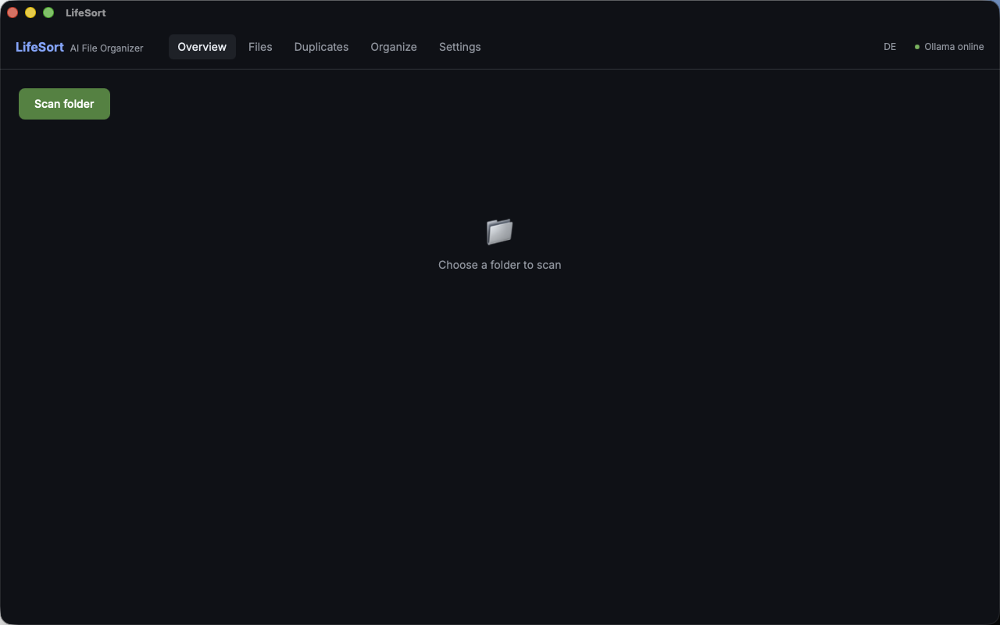

<div align="center">
  

  <h1>LifeSort</h1>
</div>

[🇩🇪 Deutsche Version](README.de.md)

**AI-powered local file organizer. Offline, private, cross-platform, built with Rust and Tauri.**

LifeSort automatically recognizes, classifies, tags, and sorts files, photos, PDFs, and documents into a clean folder structure; **fully offline**, using local AI models. No cloud, no tracking, no manual sorting.

[](https://github.com/9t29zhmwdh-coder/LifeSort/actions)      

> **How it runs:** LifeSort is a native desktop app, not a server or browser tool. It opens as its own window, works fully offline, and has no tray icon or background service; it only runs while the window is open.



**In practice:** you scan a folder once, LifeSort classifies every file locally with Ollama, and you get a clean overview with sort suggestions you confirm before anything moves. AI only assists with recognition, tagging, and summaries; the underlying scan, hash, and move logic works without it.

---

> 🌱 New here? → [Step-by-step guide for beginners](GETTING_STARTED.md)

---

## Features

| Feature | Description |
|---|---|
| **Photo Recognition** | Detects people, places, events, screenshots, memes via vision model |
| **Document Classification** | Invoices, contracts, guarantees, tax documents, letters |
| **PDF Analysis** | Extracts sender, date, amount, document type via OCR + AI |
| **Download Sorting** | Automatically categorizes installers, archives, assets, junk |
| **Smart Tagging** | AI-generated tags per file |
| **Duplicate Detection** | BLAKE3 content hashing, wasted space report |
| **Organization Proposals** | Suggests move actions, shows target path and reason: user confirms |
| **Plugin System** | Custom file type handlers via Rust trait |

---

## Requirements

- [Rust](https://rustup.rs/) 1.77+
- [Node.js](https://nodejs.org/) 20+
- [Tauri CLI v2](https://tauri.app/): `cargo install tauri-cli`
- [Ollama](https://ollama.ai): `ollama pull llama3 && ollama pull llava`
- macOS / Windows / Linux

---

## Quick Start

```bash
git clone https://github.com/9t29zhmwdh-coder/LifeSort
cd LifeSort

ollama pull llama3
ollama pull llava

cd frontend && npm install && cd ..
cargo tauri dev
```

---

## Uninstall / Cleanup

LifeSort is a self-contained app with no installer and no background service.

- **macOS:** delete the app bundle, then remove `~/Library/Application Support/LifeSort/` (database, settings) and `~/Library/Logs/LifeSort/` if present.
- **Windows:** remove the app folder, then delete `%APPDATA%\LifeSort\`.
- LifeSort never touches your original files outside the folders you explicitly scan and organize; there is nothing else to clean up.

---

## Privacy

LifeSort processes all files **locally on your machine**. No data is uploaded to the cloud. Ollama runs the models entirely offline; your files never leave your device.

---

## Architecture

```
LifeSort/
├── crates/ls-core/      # Rust: scanner, classifier, tagger, DB
├── crates/ls-cli/       # CLI binary
├── src-tauri/           # Tauri v2 backend + IPC commands
└── frontend/            # React + TypeScript + Tailwind + Recharts
```

### Output Folder Structure

```
LifeSort/
├── Photos/      People/  Places/  Events/{Year}/  Screenshots/
├── Documents/   Invoices/{Year}/  Contracts/  Taxes/{Year}/
├── Downloads/   Installers/  Archives/  Assets/  Junk/
└── Media/       Videos/  Audio/
```

---

**Author:** [Rafael Yilmaz](https://github.com/9t29zhmwdh-coder) · **Status:** Active ·  · **License:** MIT
