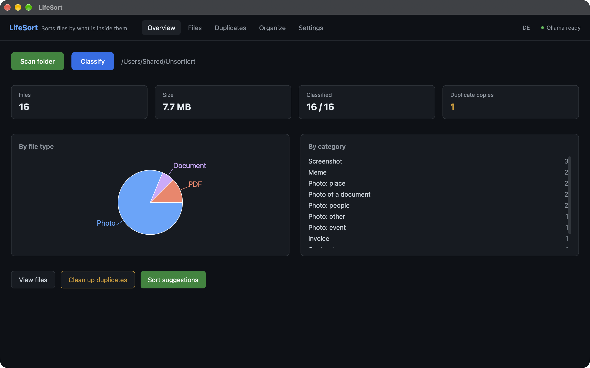

<div align="center">
  

  <h1>LifeSort</h1>
</div>

[🇩🇪 Deutsche Version](README.de.md)

**Sorts the pile where the filenames tell you nothing.**

`IMG_4471.jpg`, `Scan_002.pdf`, `Download (3).pdf`. LifeSort opens them and
sorts by what is actually inside: a local model looks at the photos and reads
the documents. It runs on your machine through [Ollama](https://ollama.com).

**Not for you if** your files are already named sensibly and a rule like "PDFs
into Documents" would do. That is a rule engine's job, and
[CleanFlow](https://github.com/9t29zhmwdh-coder/CleanFlow) is the one in this
portfolio: it plans by rule, shows you the plan, and journals every action so
you can undo it. LifeSort is for the case where no rule helps because the
filename says nothing.

**Folders and the Apple Photos library.** In folders LifeSort moves files into
place. The Photos library it never changes: on macOS it finds what takes space
there and collects it in albums, and you delete in the Photos app, which frees
the space on your iPhone too through iCloud. See [Apple Photos mode](#apple-photos-mode-macos).

Nothing is moved without your confirmation, and nothing leaves the machine.

[](https://github.com/9t29zhmwdh-coder/LifeSort/actions) [](https://github.com/9t29zhmwdh-coder/LifeSort/security/code-scanning) [](https://securityscorecards.dev/viewer/?uri=github.com/9t29zhmwdh-coder/LifeSort) [](https://www.bestpractices.dev/projects/13699)

     

> **How it runs:** LifeSort is a native desktop app, not a server or browser tool. It opens as its own window, works fully offline, and has no tray icon or background service; it only runs while the window is open.



---

> 💾 **Download:** [macOS (DMG)](https://github.com/9t29zhmwdh-coder/LifeSort/releases/latest/download/LifeSort.dmg) · [Windows (Installer)](https://github.com/9t29zhmwdh-coder/LifeSort/releases/latest/download/LifeSort-Setup.exe) · [Linux (AppImage)](https://github.com/9t29zhmwdh-coder/LifeSort/releases/latest/download/LifeSort.AppImage): always the latest release, not code-signed/notarized (Gatekeeper/SmartScreen will warn on first run). Or build from source, see Getting Started below.

---

LifeSort's UI is available in English and German; switch anytime with the language toggle. LifeSort's UI follows the system language on first start.

**In practice:** you scan a folder, LifeSort classifies every file locally, and you get an overview with sort suggestions you confirm before anything moves. Without Ollama it still works on rules (screenshots, documents by keywords, downloads by type) and says so on screen; the model adds recognition of people, places, events, memes and photographed documents.

---

> 🌱 New here? → [Step-by-step guide for beginners](GETTING_STARTED.md)

---

## Features

| Feature | What it does |
|---|---|
| **Photo recognition** | People, places, events, screenshots, memes, photographed documents, through a local vision model. HEIC from the iPhone is read on macOS |
| **Screenshots without AI** | Recognised by the iOS EXIF marker, the file name, or the exact screen size of iPhones, iPads, Android phones and Macs |
| **Document classification** | Invoices, contracts, guarantees, tax documents, letters, certificates, reports, with date and amount. Reads PDFs with a text layer and plain text files |
| **Download sorting** | Installers, archives, assets and junk by type and name |
| **Duplicate detection** | Identical content by size and BLAKE3 hash; copies go to the Trash only after you confirm |
| **Sort suggestions** | A target folder per file, in the UI language, shown before anything moves. Same names get `(2)`, nothing is ever overwritten |
| **Undo** | Every move is journaled; undo works after a restart too and refuses when the original place is taken again |
| **Apple Photos mode** (macOS) | Finds large videos, screenshots, unpicked burst frames, memes and photos of receipts in the Photos library and collects them in albums. Deletes nothing |

**Limits, stated plainly:** scanned PDFs have no text layer and LifeSort has no OCR, so they stay "unknown". Word and Excel files are not read. HEIC needs macOS; on Windows and Linux HEIC photos are sorted by rules only.

---

## Apple Photos mode (macOS)

The "Photos library" tab reads the Photos library through Apple's PhotoKit and groups what takes space:

- **Videos**, largest first, usually most of the space
- **Screenshots** that Photos itself marks
- **Burst frames** nobody picked, read from PhotoKit's burst data (the test library had no bursts, so this group is untested)
- With the model: **memes and greeting pictures**, **photos of receipts and documents**, and screenshots Photos did not mark

Each group becomes an album named "LifeSort: …" in Photos. **LifeSort never deletes or moves a photo.** Open the album in Photos, pick what should go and delete it there; with iCloud Photos the space is freed on the iPhone too, and deleted items stay 30 days in Recently Deleted. Favourites are never suggested. macOS asks once for access. The model sees small previews; originals stored only in iCloud are not downloaded.

Tested on a library of 46 photos and 3 videos with `qwen3.5:4b-mlx`: all 6 memes, all 7 photos of documents and all 7 screenshots were found, the favourite video was left out, and creating an album twice extended it instead of making a second one. Two ordinary photos, a dark food picture and a party photo, also landed under screenshots, so look through an album before deleting. At about 3 seconds per photo on an M4 Pro, a library of 10,000 photos takes most of a night; the run can be stopped and continued.

---

## Which model for which Mac

One model does both photos and documents, so only one has to fit into memory. Measured with the app's own code on 48 photos in 7 categories and 14 documents in German, English and French (`cargo run --release --example bench_vision` and `bench_text`, sources and licences in [docs/benchmark](docs/benchmark)).

| Model | Memory in use | Photos correct | Documents correct | Seconds per photo* |
|---|---|---|---|---|
| **`qwen3.5:9b-mlx`** | 9.0 GB | **98 %** | 93 % | 5.6 |
| **`qwen3.5:4b-mlx`** (default on macOS) | 4.1 GB | **92 %** | 93 % | 3.1 |
| `qwen3.5:4b` (default on Windows, Linux) | 3.4 GB | 92 % | 93 % | 3.6 |
| `gemma4:12b-mlx` | 7.7 GB | 92 % | 93 % | 4.0 |
| `qwen2.5vl:7b` | 7.3 GB | 88 % | | 7.1 |
| `minicpm-v4.6` | 0.8 GB | 75 % | 86 % | 1.2 |
| `llava:7b` (the old default) | 5.4 GB | 75 % | | 3.7 |
| `qwen3.5:2b-mlx` | 3.1 GB | 46 % | 71 % | 2.0 |
| rules only, no model | 0 | screenshots only | 86 % | |

\* On an M4 Pro. Not measured on M1 or M2; expect them to take several times as long. At 3 seconds a photo, 1,000 photos take about 50 minutes, so a large folder is a job for overnight.

| Your Mac | Take | Why |
|---|---|---|
| 8 GB | `qwen3.5:4b-mlx` | macOS lends the GPU about two thirds of the memory, roughly 5 GB. Close other apps; if it still runs out, `minicpm-v4.6` |
| 16 GB | `qwen3.5:9b-mlx` | Fits the roughly 10.7 GB the GPU gets. With many apps open, `qwen3.5:4b-mlx` |
| 24 GB or more | `qwen3.5:9b-mlx` | The 27B models need 18 GB and more; they do not fit a 24 GB MacBook Air |
| Windows, Linux | `qwen3.5:4b` | MLX builds run on Apple silicon only |

The `-mlx` builds run on Apple's MLX engine inside Ollama and need Apple silicon. The remaining misses of the recommended models are almost all in one place: food photographed at a restaurant table is called an event. Screenshots, memes, documents and people were recognised every time.

---

## Requirements

- [Ollama](https://ollama.com) with one model from the table above, for example `ollama pull qwen3.5:4b-mlx`. Optional: without it LifeSort sorts by rules
- To build from source: [Rust](https://rustup.rs/) 1.87 or newer, [Node.js](https://nodejs.org/) 20+, [Tauri CLI v2](https://tauri.app/) (`cargo install tauri-cli`)
- macOS, Windows or Linux

---

## Quick Start

```bash
git clone https://github.com/9t29zhmwdh-coder/LifeSort
cd LifeSort

ollama pull qwen3.5:4b-mlx      # on Windows or Linux: qwen3.5:4b

cd frontend && npm install && cd ..
cargo tauri dev
```

The command line does the same without a window:

```bash
cargo run -p ls-cli -- organize ~/Downloads --target ~/Sorted            # dry run, rules only
cargo run -p ls-cli -- organize ~/Downloads --target ~/Sorted --ai       # with the default model
cargo run -p ls-cli -- organize ~/Downloads --target ~/Sorted --ai --execute
```

---

## Uninstall / Cleanup

LifeSort has no background service.

- **macOS:** delete the app, then `~/Library/Application Support/ch.raystudio.lifesort/` (move journal and settings).
- **Windows:** uninstall the app, then delete `%APPDATA%\ch.raystudio.lifesort\`.
- **Linux:** delete the AppImage, then `~/.local/share/ch.raystudio.lifesort/`.
- Models stay in Ollama until you remove them: `ollama rm qwen3.5:4b-mlx`.
- Access to Photos is revoked in System Settings > Privacy & Security > Photos, or with `tccutil reset Photos ch.raystudio.lifesort`. The albums LifeSort created stay in Photos until you delete them; deleting an album keeps its photos.
- LifeSort never touches files outside the folders you scan and the target folder you choose.

---

## Privacy

Everything stays on your machine. Photos and documents go only to the Ollama address in the settings, `localhost` by default. No telemetry, no fonts or scripts from the internet. Details in [PRIVACY.md](PRIVACY.md).

---

## Architecture

```
LifeSort/
├── crates/ls-core/      # Rust: scanner, classifier, organizer, journal
├── crates/ls-cli/       # CLI binary
├── crates/ls-photos/    # Apple Photos library through PhotoKit (macOS)
├── src-tauri/           # Tauri v2 backend + IPC commands
└── frontend/            # React + TypeScript + Tailwind + Recharts
```

More in [ARCHITECTURE.md](ARCHITECTURE.md).

### Folders LifeSort creates

Names follow the UI language (German: `Fotos/Personen`, `Dokumente/Rechnungen/2024`, …).

```
Photos/      People/  Places/  Events/{Year}/  Screenshots/  Memes/  Documents/  Other/
Documents/   Invoices/{Year}/  Contracts/  Guarantees/  Taxes/{Year}/  Letters/  Certificates/  Reports/
Downloads/   Installers/  Archives/  Assets/  Junk/
Media/       Videos/  Audio/
Code/  Other/
```

---

**Author:** [Rafael Yilmaz](https://github.com/9t29zhmwdh-coder) · **Status:** Active ·  · **License:** MIT
